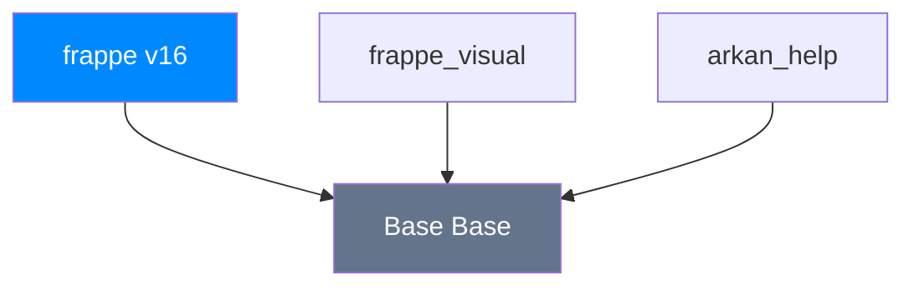

# Base Base — Dependency Graph
# بيس بيس — مخطط التبعيات

```mermaid
graph TD
    frappe["frappe v16"]
    frappe_visual["frappe_visual"]
    arkan_help["arkan_help"]
    base_base["Base Base"]
    frappe --> base_base
    frappe_visual --> base_base
    arkan_help --> base_base
    style base_base fill:#64748B,color:#fff
    style frappe fill:#0089FF,color:#fff
```
