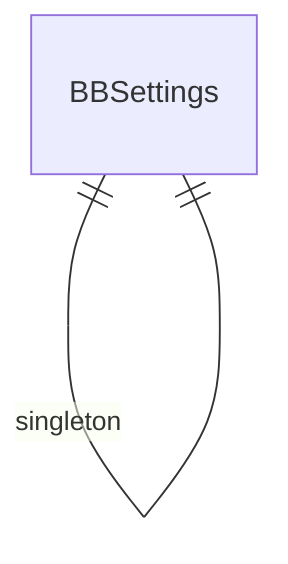

# Base Base — Entity Relationship Diagram
# بيس بيس — مخطط العلاقات

> 0 DocTypes

> **Note:** This is a placeholder ERD. Update with actual DocType relationships from the JSON definitions.
> Run: `ls base_base/base_base/*/doctype/` to discover all DocTypes and their Link fields.
