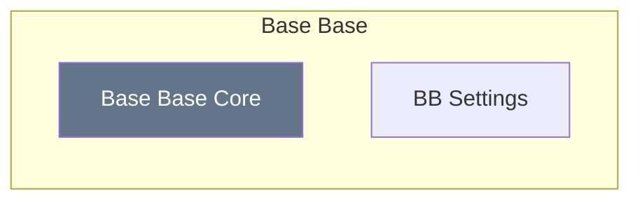

# Base Base — Module Map
# بيس بيس — خريطة الوحدات

```mermaid
graph LR
    subgraph Base Base
        Core["Base Base Core"]
        Settings["BB Settings"]
    end
    style Core fill:#64748B,color:#fff
```

> **Note:** This is a placeholder module map. Update with actual modules from `modules.txt`.
